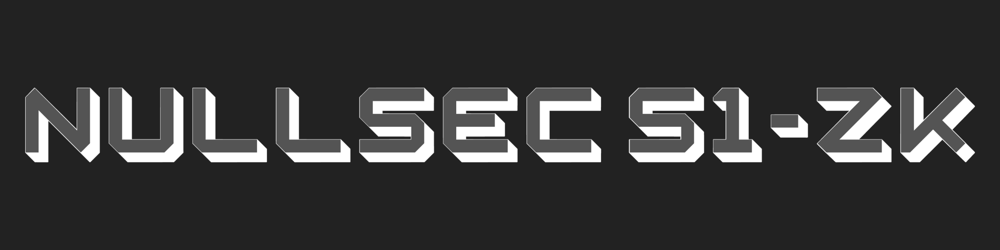

# Nullsec S1-ZK

<p align="center">
  
</p>

<p align="center">
  <a href="https://www.npmjs.com/package/@trynullsec/s1-zk"></a>
  <a href="https://www.npmjs.com/package/@trynullsec/s1-zk"></a>
  
  
  
  
  
</p>

**AI-native auditing for zero-knowledge circuits.**

Nullsec S1-ZK is a static analysis engine for zero-knowledge circuits. It audits what a circuit actually constrains, not just what it claims to prove.

**Find underconstraints before they mint infinite money.**

```bash
npx @trynullsec/s1-zk scan ./circuits
```

## Why S1-ZK Exists

Catastrophic ZK bugs are often not ordinary application bugs. They are proof-system semantic failures: a witness can satisfy the constraint system while violating the protocol statement developers believe is being proven.

Nullsec S1-ZK is built around one question:

> What does this circuit claim to prove, and what does it actually constrain?

The tool is designed for ZK auditors, protocol engineers, security researchers, and crypto developers who need fast, deterministic signal on underconstraints, unsafe witness assignments, missing public bindings, selector mistakes, incomplete EC relations, and other soundness risks.

## Supported Frontends

### Circom

The Circom frontend parses `.circom` files and builds a signal/constraint graph for high-signal soundness checks:

- Dangerous hint assignments with `<--`
- Assigned-but-unconstrained signals
- Unbound inputs
- Unconstrained outputs
- Missing booleanity checks
- Missing range checks
- Unsafe assertions
- Unsafe division or inverse patterns
- Alias and overflow risks
- Suspicious selectors

### Halo2-Style Rust

The Halo2 frontend scans Rust source for Halo2 patterns and builds a best-effort constraint graph over gates, regions, selectors, equality edges, and public bindings:

- Assigned advice not constrained
- Instance value not bound
- Selector discipline risk
- Unsafe inverse/division
- Partial EC operation risk
- Missing `enable_equality` assumptions
- Gate extraction
- Assignment connectivity
- Equality/copy edges
- Public instance bindings

## Deep Analysis Mode

`--deep` enables relationship-aware analysis beyond individual rule hits:

- Proof obligation extraction
- Relation checking
- Taint/witness flow analysis
- Exploit hypothesis generation

```bash
npx @trynullsec/s1-zk scan ./circuits --deep
```

Example deep-analysis output:

```text
Proof obligations:
Total      68
Satisfied  59
Missing    9

Exploit hypothesis:
A malicious prover may choose EC point coordinates independently of the claimed scalar multiplication relation. If the verifier accepts those values as part of the EC output, the circuit may verify an invalid group operation.
```

Deep mode is still static analysis. It infers likely proof obligations from naming, graph relationships, and source structure, then checks whether parsed constraints appear to support those obligations.

## Installation

Run without installing:

```bash
npx @trynullsec/s1-zk scan ./circuits
```

Install globally:

```bash
npm install -g @trynullsec/s1-zk
```

## Usage

```bash
nullsec-zk scan ./circuits
nullsec-zk scan ./circuits --deep
nullsec-zk scan ./circuits --format json
nullsec-zk scan ./circuits --report markdown
nullsec-zk rules
nullsec-zk explain NS-H2-005
nullsec-zk init
```

The same commands work through `npx`:

```bash
npx @trynullsec/s1-zk scan ./circuits --deep
npx @trynullsec/s1-zk rules
npx @trynullsec/s1-zk explain NS-H2-005
```

## Example Output

```text
Nullsec S1-ZK
AI-native auditing for zero-knowledge circuits

Target: ./examples
Frontend: Mixed
Files scanned: 24
Rules executed: 18
Issues found: 33

Severity summary:
CRITICAL  2
HIGH      12
MEDIUM    15
LOW       4
INFO      0
```

## Rule Coverage

Rules are documented in [`RULES.md`](./RULES.md). The current rule families include:

- `NS-ZK-*` rules for Circom underconstraints, unsafe hints, missing booleanity/range checks, unsafe assertions, component-output binding, and selector risks.
- `NS-H2-*` rules for Halo2 advice connectivity, public instance binding, selector discipline, inverse safety, EC operation completeness, and equality assumptions.

List rules locally:

```bash
nullsec-zk rules
```

Explain a rule:

```bash
nullsec-zk explain NS-H2-005
```

## Orchard-Inspired Benchmark

The repository includes synthetic Orchard-inspired Halo2 benchmarks under:

```text
benchmarks/historical/orchard-inspired
```

These examples are not copied from Zcash source. They are synthetic benchmark cases modeling the class of partial elliptic-curve underconstraint issues discussed publicly after the Orchard vulnerability disclosure.

Nullsec S1-ZK does not claim to have found the real Zcash bug, and it does not prove Zcash or Orchard security. The benchmark exists to research the same family of underconstraint risk in a small, auditable fixture.

Run it with deep analysis:

```bash
npx @trynullsec/s1-zk scan ./benchmarks/historical/orchard-inspired --deep
```

## Reports

Nullsec S1-ZK supports:

- Terminal output
- JSON output
- Markdown reports
- SARIF for code-scanning workflows

Examples:

```bash
nullsec-zk scan ./circuits --format json
nullsec-zk scan ./circuits --report markdown
nullsec-zk scan ./circuits --format sarif --out nullsec-zk.sarif
```

## Configuration

Create a config file:

```bash
nullsec-zk init
```

Example `.nullsec-zk.json`:

```json
{
  "rules": {
    "NS-ZK-006": "off"
  },
  "ignore": ["node_modules", "target"],
  "failOn": "HIGH"
}
```

## Limitations

Nullsec S1-ZK is a static analysis tool:

- Parsing is best-effort.
- It is not formal verification.
- It does not prove full circuit soundness.
- It does not replace expert ZK or cryptographic audits.
- Macro-heavy Rust/Halo2 code can be missed.
- Deep analysis infers likely proof obligations and can be wrong.

See [`LIMITATIONS.md`](./LIMITATIONS.md) for more detail.

## Roadmap

- Real Rust AST parsing via `syn`
- Noir frontend
- gnark frontend
- Plonky2 frontend
- R1CS extraction
- Circuit graph visualization
- GitHub Action
- Hosted dashboard
- Witness counterexample generation
- Spec-to-circuit comparison
- Historical ZK bug benchmark suite

## Security Philosophy

Nullsec S1-ZK treats ZK circuit bugs as proof semantics failures. It prioritizes cases where witness values, public claims, outputs, selectors, integer domains, and EC intermediates are not bound by constraints in the way the protocol likely intends.

The goal is not to replace human auditors. The goal is to give auditors sharper graph-aware evidence faster.

## License

MIT
